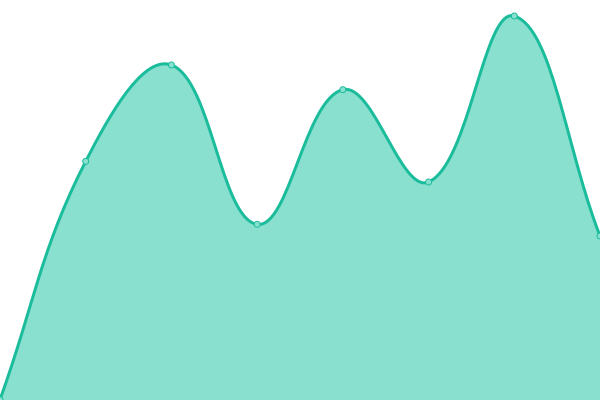

# [📈 Live Status](https://status.bigbang1112.cz): <!--live status--> **🟧 Partial outage**

This repository contains the open-source uptime monitor and status page for [Petr Pivoňka](bigbang1112.cz), powered by [Upptime](https://github.com/upptime/upptime).

With [Upptime](https://upptime.js.org), you can get your own unlimited and free uptime monitor and status page, powered entirely by a GitHub repository. We use [Issues](https://github.com/bigbang1112/bigbang1112cz-uptime/issues) as incident reports, [Actions](https://github.com/bigbang1112/bigbang1112cz-uptime/actions) as uptime monitors, and [Pages](https://status.bigbang1112.cz) for the status page.

<!--start: status pages-->
<!-- This summary is generated by Upptime (https://github.com/upptime/upptime) -->
<!-- Do not edit this manually, your changes will be overwritten -->
<!-- prettier-ignore -->
| URL | Status | History | Response Time | Uptime |
| --- | ------ | ------- | ------------- | ------ |
|  [bigbang1112.cz](https://bigbang1112.cz) | 🟩 Up | [bigbang1112-cz.yml](https://github.com/BigBang1112/bigbang1112cz-uptime/commits/HEAD/history/bigbang1112-cz.yml) | 

 655ms
     
 | 

<a href="https://status.bigbang1112.cz/history/bigbang1112-cz">100.00%</a>
    

|  [v2.bigbang1112.cz](https://v2.bigbang1112.cz) | 🟩 Up | [v2-bigbang1112-cz.yml](https://github.com/BigBang1112/bigbang1112cz-uptime/commits/HEAD/history/v2-bigbang1112-cz.yml) | 

 908ms
     
 | 

<a href="https://status.bigbang1112.cz/history/v2-bigbang1112-cz">100.00%</a>
    

|  [gbx.bigbang1112.cz (Gbx Web Tools)](https://gbx.bigbang1112.cz) | 🟩 Up | [gbx-bigbang1112-cz.yml](https://github.com/BigBang1112/bigbang1112cz-uptime/commits/HEAD/history/gbx-bigbang1112-cz.yml) | 

 890ms
     
 | 

<a href="https://status.bigbang1112.cz/history/gbx-bigbang1112-cz">100.00%</a>
    

|  [wr.bigbang1112.cz (TMWR / World Record Report)](https://wr.bigbang1112.cz) | 🟩 Up | [wr-bigbang1112-cz.yml](https://github.com/BigBang1112/bigbang1112cz-uptime/commits/HEAD/history/wr-bigbang1112-cz.yml) | 

 860ms
     
 | 

<a href="https://status.bigbang1112.cz/history/wr-bigbang1112-cz">100.00%</a>
    

|  [tmtr.bigbang1112.cz](https://tmtr.bigbang1112.cz) | 🟩 Up | [tmtr-bigbang1112-cz.yml](https://github.com/BigBang1112/bigbang1112cz-uptime/commits/HEAD/history/tmtr-bigbang1112-cz.yml) | 

 899ms
     
 | 

<a href="https://status.bigbang1112.cz/history/tmtr-bigbang1112-cz">100.00%</a>
    

|  [api.tmwrr.bigbang1112.cz](https://api.tmwrr.bigbang1112.cz) | 🟩 Up | [api-tmwrr-bigbang1112-cz.yml](https://github.com/BigBang1112/bigbang1112cz-uptime/commits/HEAD/history/api-tmwrr-bigbang1112-cz.yml) | 

 844ms
     
 | 

<a href="https://status.bigbang1112.cz/history/api-tmwrr-bigbang1112-cz">100.00%</a>
    

|  [purge2.bigbang1112.cz (TMUF Purge 2)](https://purge2.bigbang1112.cz) | 🟩 Up | [purge2-bigbang1112-cz.yml](https://github.com/BigBang1112/bigbang1112cz-uptime/commits/HEAD/history/purge2-bigbang1112-cz.yml) | 

 1201ms
     
 | 

<a href="https://status.bigbang1112.cz/history/purge2-bigbang1112-cz">100.00%</a>
    

|  [antislowmo.bigbang1112.cz (TMUF Purge 1)](https://antislowmo.bigbang1112.cz) | 🟩 Up | [antislowmo-bigbang1112-cz.yml](https://github.com/BigBang1112/bigbang1112cz-uptime/commits/HEAD/history/antislowmo-bigbang1112-cz.yml) | 

 1397ms
     
 | 

<a href="https://status.bigbang1112.cz/history/antislowmo-bigbang1112-cz">100.00%</a>
    

|  [dortmund.antislowmo.bigbang1112.cz (TMUF Purge 1, Dortmund)](https://dortmund.antislowmo.bigbang1112.cz) | 🟩 Up | [dortmund-antislowmo-bigbang1112-cz.yml](https://github.com/BigBang1112/bigbang1112cz-uptime/commits/HEAD/history/dortmund-antislowmo-bigbang1112-cz.yml) | 

 1286ms
     
 | 

<a href="https://status.bigbang1112.cz/history/dortmund-antislowmo-bigbang1112-cz">100.00%</a>
    

|  [winget.bigbang1112.cz](https://winget.bigbang1112.cz) | 🟥 Down | [winget-bigbang1112-cz.yml](https://github.com/BigBang1112/bigbang1112cz-uptime/commits/HEAD/history/winget-bigbang1112-cz.yml) | 

 0ms
     
 | 

<a href="https://status.bigbang1112.cz/history/winget-bigbang1112-cz">0.00%</a>
    

<!--end: status pages-->

[**Visit our status website →**](https://status.bigbang1112.cz)

## 📄 License

- Powered by: [Upptime](https://github.com/upptime/upptime)
- Code: [MIT](./LICENSE) © [Anand Chowdhary](https://anandchowdhary.com), supported by [Pabio](https://pabio.com)
- Data in the `./history` directory: [Open Database License](https://opendatacommons.org/licenses/odbl/1-0/)
